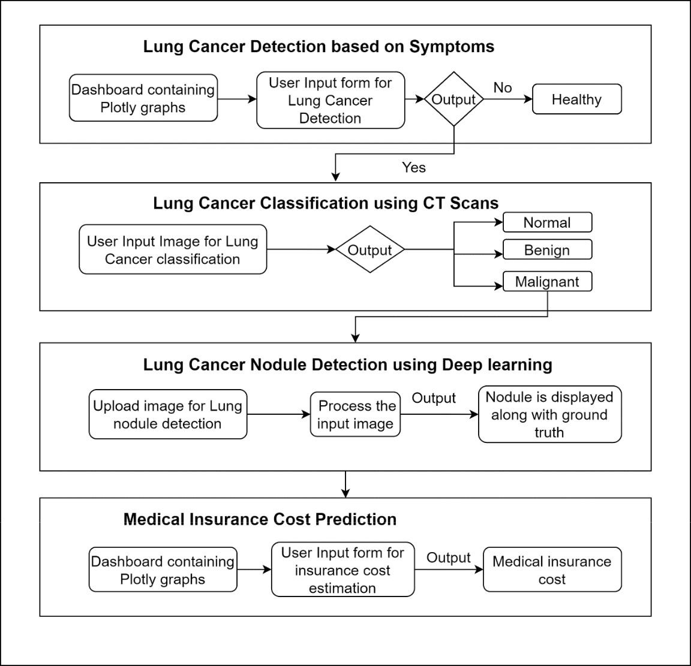
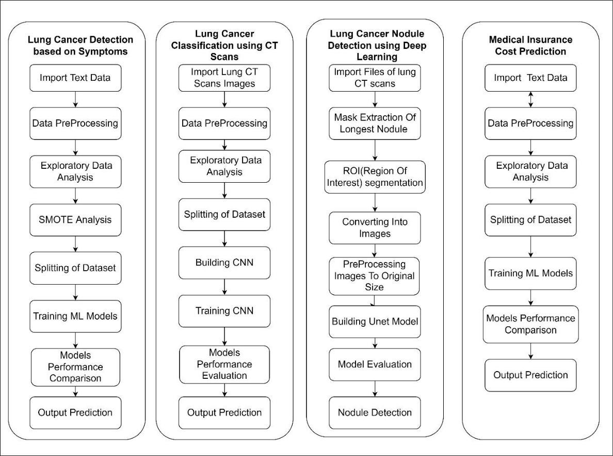
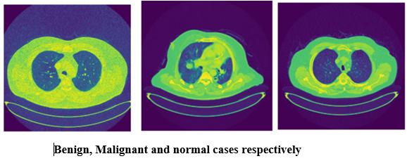
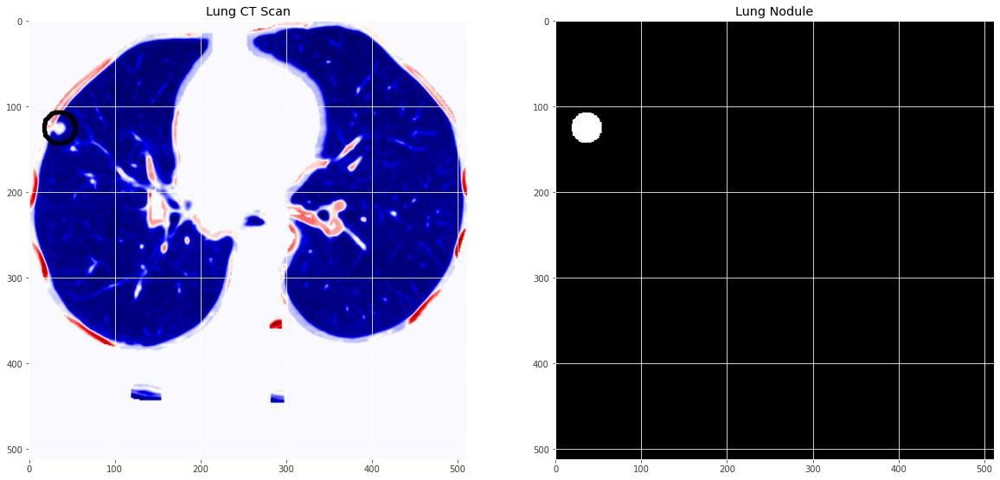
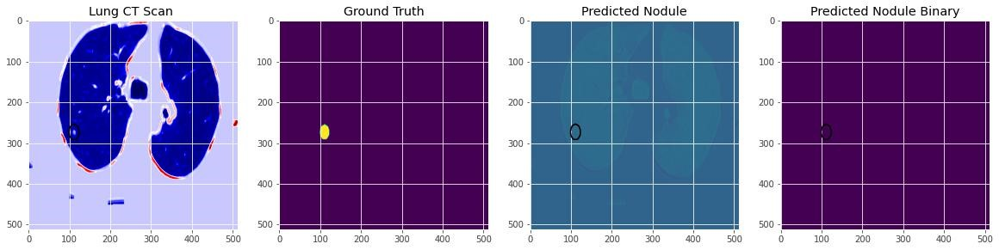
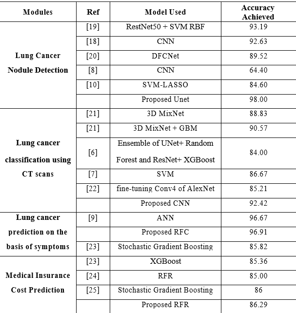

# Major_Project

The primary goal of this project is to examine prior medical information in order to detect lung cancer, predict if the patient has lung cancer using the CT scans and then predict the stage of lung cancer by nodule detection. Additional aid is provided by anticipating medical insurance expenditures.
 
### The flowchart of the proposed design:

### The methodology:

### The three cases of Lung Cancer

### Example of detected nodule in CT Scan

### The ouput of nodule detected in the project

### Comparison of the various models implemented with state of the work

